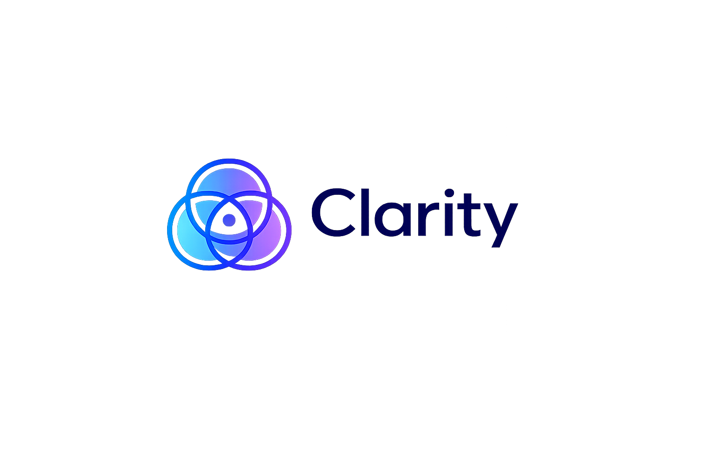
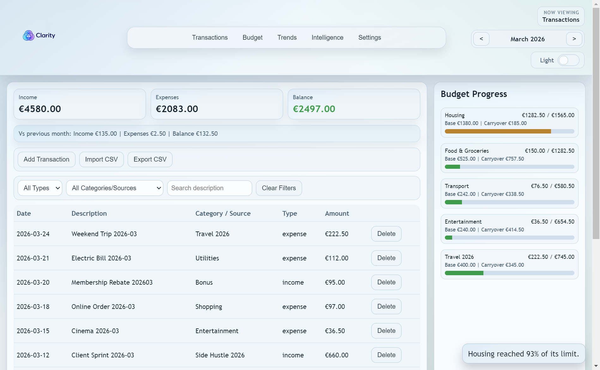
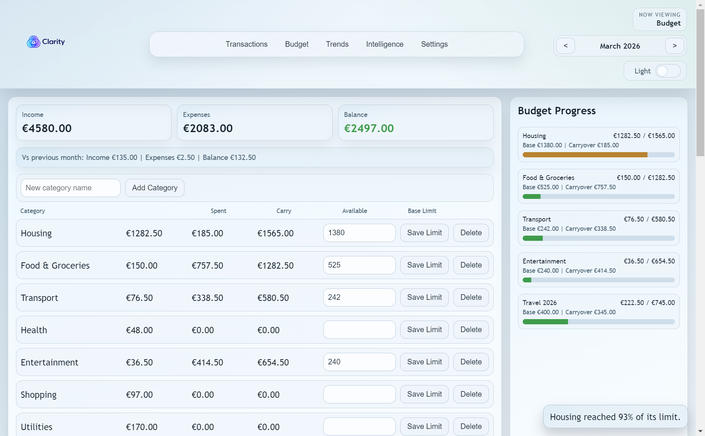
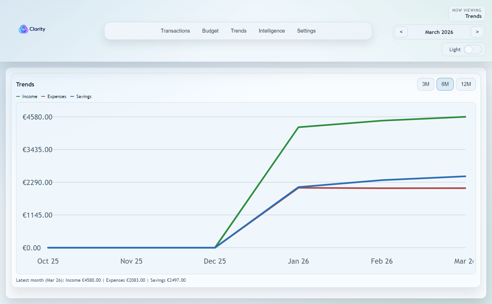
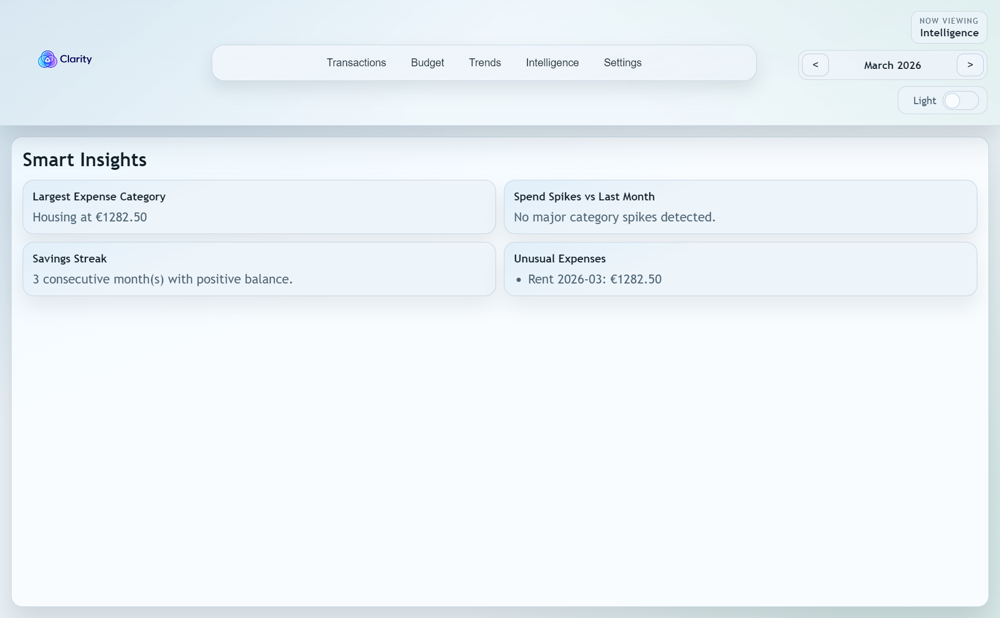
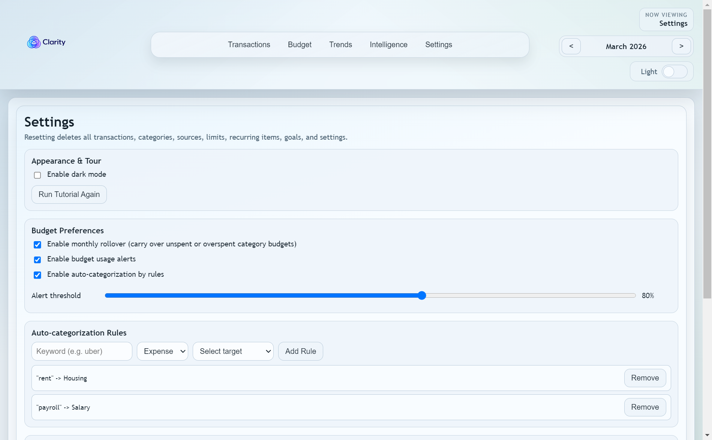

<p align="center">
  
</p>

<h1 align="center">Clarity</h1>
<p align="center"><strong>Offline-first personal finance desktop app for Windows.</strong></p>

<p align="center">
  
  
  
  
</p>

---

## Why Clarity?

Managing your money shouldn't cost money.

Spreadsheets become hard to maintain. Many budget apps charge monthly fees for features you may not use. Clarity is built as an alternative: free for non-commercial use, open source, local-first on your own machine, and no cloud lock-in.

> Non-commercial license: Clarity can be used, forked, and contributed to for non-commercial use. See [LICENSE](./LICENSE).

---

## Features

### Transactions
- Required fields: date, description, amount, type
- Expense category and income source are enforced by transaction type
- Immutable workflow: correct by delete + recreate
- Undo for recent actions (toast + action history)
- Recurring monthly transactions with preview
- CSV import/export
- Rule-based auto-categorization by keyword

### Navigation and Insights
- Month-based views with month-over-month deltas
- Filtering by type + category/source (AND logic)
- Separate tabs for Transactions, Budget, Trends, Intelligence, and Settings

### Budget Management
- Category limits with utilization bars
- Categories/sources cannot be deleted while in use
- Savings goals with contributions
- Automatic contribution schedules per goal

### App
- Direct autosave in local JSON (no account, no cloud required)
- Optional PIN lock
- Full backup export/import (JSON)
- Auto-update via GitHub Releases

---

## Screenshots

### Transactions


### Budget


### Trends


### Intelligence


### Settings


---

## Installation

### Recommended: installer from Releases
1. Go to [Releases](../../releases)
2. Download `Clarity Setup <version>.exe`
3. Run the installer

### Run from source

```bash
npm install 
npm start
# Demo seed mode (date-based sample data for testing/screenshots)
npm run start:demo
```

---

## Development

```bash
# Dependencies
npm install

# Start app
npm start

# Start app with demo seed data
npm run start:demo

# Tests
npm test

# Renderer build
npm run build

# Installer build
npm run dist
```

Installer artifacts in `dist/`:
- `Clarity Setup <version>.exe`
- `Clarity Setup <version>.exe.blockmap`
- `latest.yml`

---

## Project Status

- Development status: **active**
- Maintained by: **Clarity contributors**
- Release workflow: **GitHub Actions** (`.github/workflows/release.yml`)

---

## Latest Update Notes

**Last updated:** March 5, 2026

- First launch v1.0.0

## Documentation

- Release notes template: [RELEASE_HIGHLIGHTS_TEMPLATE](./docs/RELEASE_HIGHLIGHTS_TEMPLATE.md)
- Contributing guide: [CONTRIBUTING](./docs/CONTRIBUTING.md)
- Code of Conduct: [CODE_OF_CONDUCT](./docs/CODE_OF_CONDUCT.md)
- Security policy: [SECURITY](./docs/SECURITY.md)
- License: [LICENSE](./LICENSE)

---

## Contributing

Issues and PRs are welcome. Prefer opening an issue first to align on context and scope.

For maintainers:
1. Bump `version` in `package.json`
2. Commit and tag (`vX.Y.Z`)
3. Push the tag so the release workflow can publish the installer
